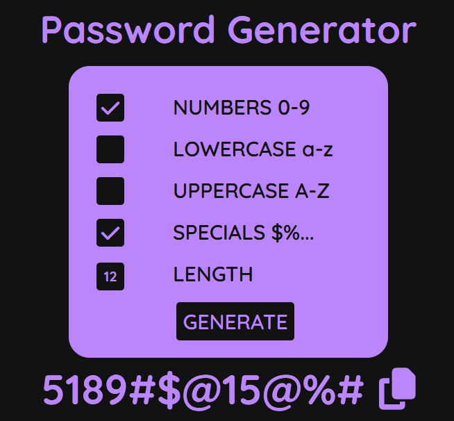

# Password Generator

## Description

This is a random password generator developed with HTML, CSS, and JavaScript. It allows generating customized passwords with different character types and configurable lengths.

## Features

- Random password generation.
- Options to include:
  - Numbers (0-9)
  - Lowercase letters (a-z)
  - Uppercase letters (A-Z)
  - Special characters (@, €, #, £, $, §, %, &)
- Configurable password length.
- Copy password to clipboard with a single click.
- Attractive and easy-to-use interface.

## Technologies Used

- HTML5
- CSS3
- JavaScript (ES6)

## Installation and Usage

1. Clone this repository or download the files manually.
2. Open the `index.html` file in your preferred browser.
3. Configure the desired options and press the "Generate" button to create a password.
4. Click the copy icon to save the password to the clipboard.

## Project Structure

```
password-generator/
│-- index.html
│-- styles/
│   ├── password.css
│-- scripts/
│   ├── password.js
```

## Screenshot



## License

This project is licensed under the MIT License.

